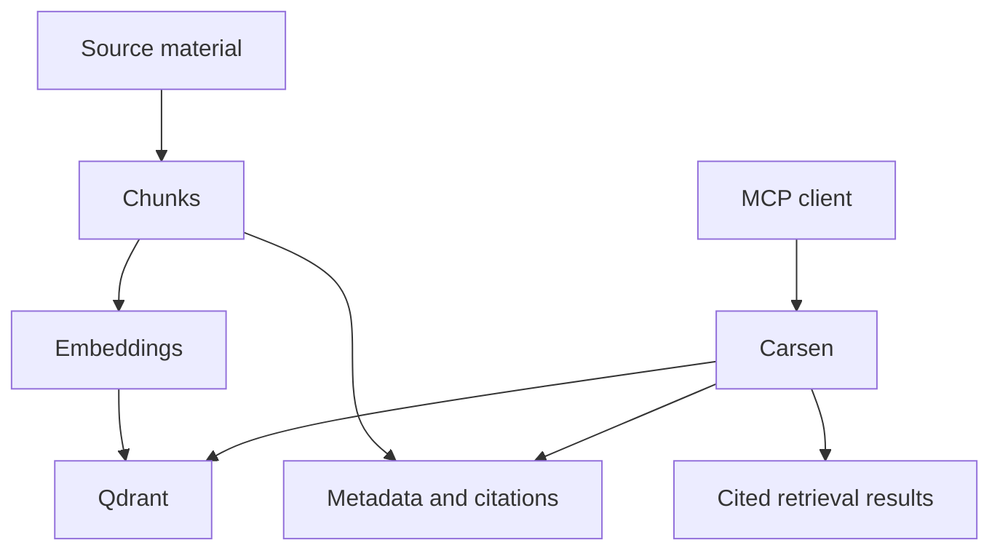

# Core concepts

Carsen combines several ideas that may be unfamiliar if you mostly work with traditional scripts, notebooks and file systems. This section explains the vocabulary before going deeper into configuration or deployment.

Start with:

- [MCP](concepts/mcp.md)
- [Qdrant](concepts/qdrant.md)
- [Embeddings](concepts/embeddings.md)
- [Chunks and citations](concepts/chunks-and-citations.md)
