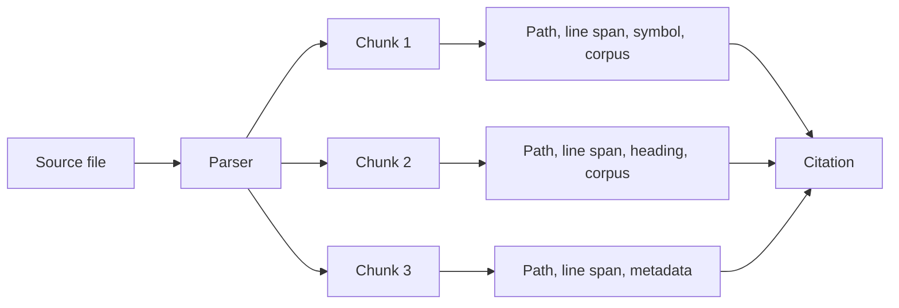

# Chunks and citations

Carsen does not index a whole project as one large text. It splits source material into smaller records called chunks. Each chunk carries metadata that helps Carsen cite where it came from.

## What is a chunk?

A chunk is a manageable piece of a source file: for example a Python function, a Markdown section or a paragraph from a document. Smaller chunks make retrieval more precise.

## What is a citation?

A citation is the trace back to the original material. In Carsen this can include the source path, corpus, line span, symbol name or document heading.

## Why citations matter in academic work

Academic users need to verify claims. A retrieval result without a source trail is not enough. Carsen's citation metadata helps you inspect the original code or document before trusting an answer.
