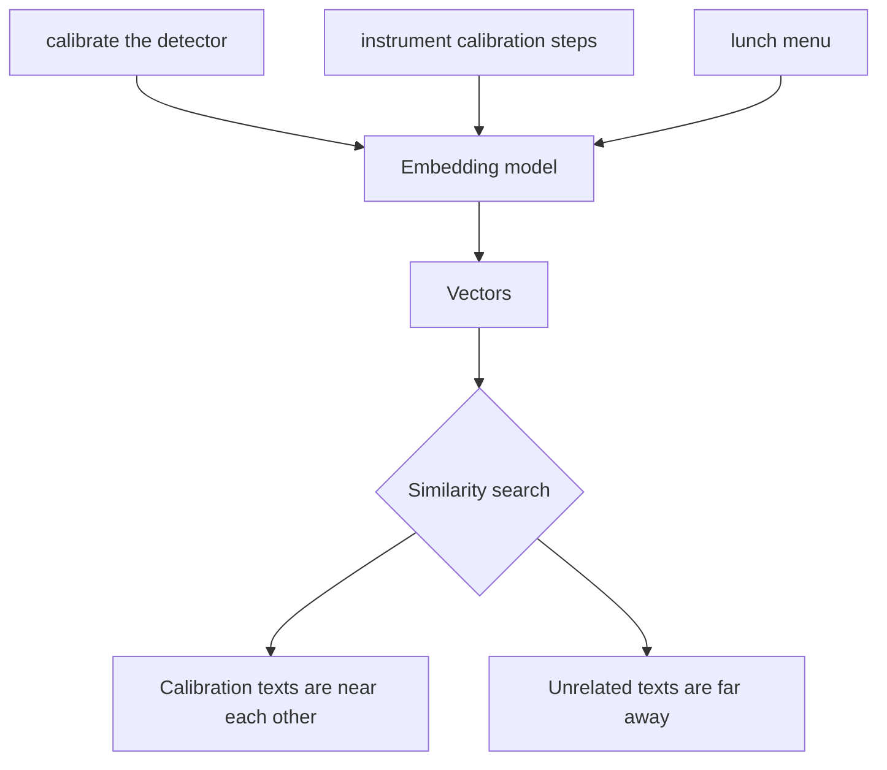

# What are embeddings?

An embedding is a list of numbers that represents the meaning of a piece of text. Similar texts should have vectors that are close to each other.

## Why this matters

Researchers rarely ask questions using exactly the same wording as the documentation. Embeddings let Carsen retrieve meaning-related passages, not only exact keyword matches.

## Limitations

Embeddings are useful but imperfect. They can miss important details or retrieve plausible but irrelevant text. Carsen therefore combines dense retrieval with sparse and exact retrieval paths, and returns citations so users can verify results.
