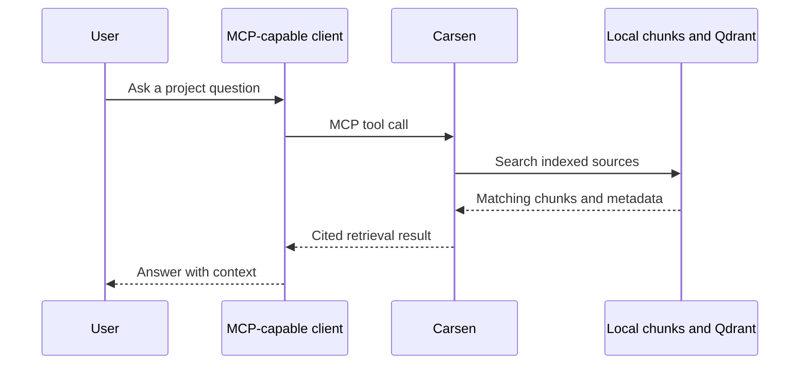

# What is MCP?

MCP stands for Model Context Protocol. It is a standard way for AI tools to ask external systems for context or actions. In Carsen, MCP lets an assistant ask questions such as "find the function that configures retrieval" or "read the source around this citation".

## Why it helps

Without MCP, an assistant often only sees the text you paste into the chat. With MCP, the assistant can request relevant project context from Carsen when it needs it.

## Important boundary

Carsen retrieves context. It does not decide which LLM writes the final answer. That keeps the retrieval layer independent from any one model provider.
