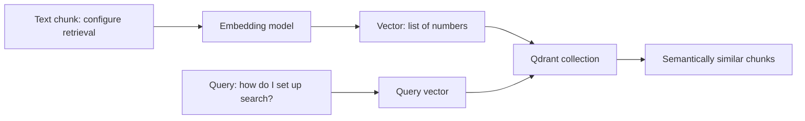

# What is Qdrant?

Qdrant is a vector database. A vector database stores numerical representations of text, called embeddings, and can find items with similar meaning even when they do not use the exact same words.



## Why Carsen uses Qdrant

Traditional search is good at exact words. Academic and technical questions often use different wording from the source material. Qdrant helps Carsen retrieve passages that are conceptually related to the query.

## What Qdrant stores

Carsen stores vectors in Qdrant collection names that are specific to each knowledge instance. The original citation metadata remains tied to Carsen's canonical chunks, so results can be traced back to source files.

## Local development

For local experiments, run Qdrant with Docker:

```bash
docker run --rm -p 6333:6333 -p 6334:6334 qdrant/qdrant
```

## Growing the collection

When a collection gets large, Carsen can pass Qdrant's own performance settings through `storage.tuning` in the instance YAML: how hard the vector index searches (`hnsw_ef`), whether stored vectors are compressed (`quantization`), and whether vectors or payloads live on disk. The [configuration guide](../configuration.md#tuning-qdrant-for-large-collections) explains when to use each. These only affect a real Qdrant server; the embedded local mode always does exact search.
