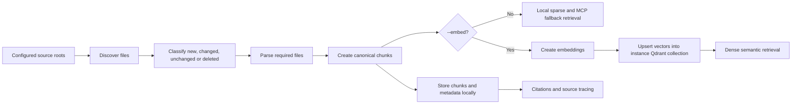

# Indexing

Indexing is invoked with:

```bash
carsen index NAME
carsen index --config path/to/config.yaml
carsen index NAME --force
carsen index NAME --embed
carsen watch NAME
```

The indexer discovers files under configured `sources.code` and `sources.documents`, computes file records, classifies files as new, unchanged, changed or deleted, then reparses only the required files unless `--force` is used.

`--embed` additionally tries to embed the canonical chunks and upsert them into the instance-specific Qdrant collection. Dense embeddings and Qdrant are optional enhancements: without them, Carsen still updates the canonical chunk store and sparse/exact MCP retrieval can use those chunks. If the dense phase fails during `carsen index --embed`, the command warns and leaves the chunk index usable.

Think of indexing as two passes:

1. **Catalogue pass**: discover files, parse them into cited chunks and write those chunks locally. This is what `carsen index NAME` does, and it is enough for sparse/exact MCP retrieval.
2. **Semantic pass**: turn chunks into vectors and write them to Qdrant. This only happens with `--embed`, and it is optional.

This means a machine without GPU, Docker or a running Qdrant service can still run Carsen usefully. Configure `retrieval.dense_candidates: 0` to make searches sparse/exact-only and avoid loading the embedding model during queries.



This flow is similar to building a catalogue for a research archive. Carsen first records what source material exists, then stores small cited records, and only then adds semantic vectors when dense search is requested.

## Discovery

Defaults ignore common generated or dependency directories such as `.git`, `.venv`, `node_modules`, `__pycache__`, `build` and `dist`. Binary extension ignores include `.pyc`, `.so`, `.dll` and `.dylib`. Symlink following is disabled by default.

## Watch indexing

Set `indexing.watch: true` to enable automatic indexing while serving, or run `carsen watch NAME` as a foreground watcher. File events are debounced by `indexing.watch_debounce_seconds` and coalesced into a single index pass. Set `indexing.watch_embed: true` to also refresh dense vectors after watched changes.

## Canonical chunks

Parsed content becomes deterministic `Chunk` records containing:

- `knowledge_id`, `source_path`, `kind`, `symbol`, line range and order.
- `text` and `metadata`.
- stable `chunk_id` based on identity and boundaries.
- `content_hash` based on current text.
- `indexed_at` timestamp.

This separates canonical identity from content changes, enabling re-embedding or invalidation without changing the source identifier when boundaries remain stable.

The local chunk store is also the fallback retrieval source for `carsen search` and the MCP runtime when dense vector services or models are unavailable.

## Re-embedding and deletion

Changing the embedding model does not require reparsing source files if canonical chunks are still valid:

```bash
carsen reembed NAME
```

`carsen reembed` is dense-only and exits nonzero if the embedding provider or vector store is unavailable.

Use `reembed` when the chunk store is already correct but the dense index needs to be rebuilt, for example after changing the embedding model. Do not use it as the first setup step on a CPU-only machine; run plain `carsen index NAME` first and confirm sparse/exact search works.

To remove the local chunk store, incremental state and dense collection for an instance:

```bash
carsen delete-index NAME
```
