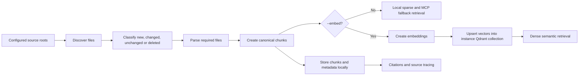

# Indexing

Indexing is invoked with:

```bash
carsen index NAME
carsen index --config path/to/config.yaml
carsen index NAME --force
carsen index NAME --embed
carsen index NAME --yes
carsen watch NAME
```

The indexer discovers files under configured `sources.code` and `sources.documents`, computes file records, classifies files as new, unchanged, changed or deleted, then reparses only the required files unless `--force` is used.

`--embed` additionally tries to embed the canonical chunks and upsert them into the instance-specific Qdrant collection. Dense embeddings and Qdrant are optional enhancements: without them, Carsen still updates the canonical chunk store and sparse/exact MCP retrieval can use those chunks. If the dense phase fails during `carsen index --embed`, the command warns and leaves the chunk index usable.

Think of indexing as two passes:

1. **Catalogue pass**: discover files, parse them into cited chunks and write those chunks locally. This is what `carsen index NAME` does, and it is enough for sparse/exact MCP retrieval.
2. **Semantic pass**: turn chunks into vectors and write them to Qdrant. This only happens with `--embed`, and it is optional.

This means a machine without GPU, Docker or a running Qdrant service can still run Carsen usefully. Configure `retrieval.dense_candidates: 0` to make searches sparse/exact-only and avoid loading the embedding model during queries.



This flow is similar to building a catalogue for a research archive. Carsen first records what source material exists, then stores small cited records, and only then adds semantic vectors when dense search is requested.

## Discovery

Defaults ignore common generated or dependency directories such as `.git`, `.venv`, `node_modules`, `__pycache__`, `build` and `dist`. Binary extension ignores include `.pyc`, `.so`, `.dll` and `.dylib`. Symlink following is disabled by default.

Before an interactive `carsen index` run, Carsen also scans configured source roots for common indexing noise such as binary/data files, archives, logs, cache/build directories and media assets. The preflight output is compact: categories are numbered and summarized with counts, total size, top extensions and a few example names rather than every matching file. Enter category numbers to add their extensions or directory names to the configuration's `indexing.ignored_extensions` and `indexing.ignored_directories`; Carsen writes the updated YAML and indexes with those ignores immediately. Use `--yes` for scripts or CI to skip the prompt while still printing the compact warning.

## Watch indexing

Set `indexing.watch: true` to enable automatic indexing while serving, or run `carsen watch NAME` as a foreground watcher. File events are debounced by `indexing.watch_debounce_seconds` and coalesced into a single index pass. Set `indexing.watch_embed: true` to also refresh dense vectors after watched changes.

A running MCP server reads chunks and runs sparse search directly against the shared SQLite store, so an indexing run from a watch thread or a separate `carsen index` invocation is visible on the next tool call. Restarting the server is not required to pick up re-indexed content.

## Canonical chunks

Parsed content becomes deterministic `Chunk` records containing:

- `knowledge_id`, `source_path`, `kind`, `symbol`, line range and order.
- `text` and `metadata`.
- stable `chunk_id` based on identity and boundaries.
- `content_hash` based on current text.
- `indexed_at` timestamp.

This separates canonical identity from content changes, enabling re-embedding or invalidation without changing the source identifier when boundaries remain stable.

After parsing, chunks larger than `parsing.max_chunk_tokens` are split into overlapping line-aligned sub-chunks so they fit the embedding model's context and keep lexical scoring focused. Sub-chunks record `parent_chunk_id`, `sub_chunk_index` and `sub_chunk_count`, and `order` is renumbered densely per file.

The local chunk store is also the fallback retrieval source for `carsen search` and the MCP runtime when dense vector services or models are unavailable.

## Online citations for public Git repositories

For local code roots inside a Git repository, Carsen records best-effort Git metadata on each chunk: the checked-out commit, repository-relative path, and configured `repository_name`. When the repository has a public GitHub or GitLab `origin`, Carsen also adds an online `citation_url` pinned to the exact commit and line span, for example:

- GitHub: `https://github.com/org/repo/blob/<commit>/src/app.py#L10-L20`
- GitLab: `https://gitlab.com/org/repo/-/blob/<commit>/src/app.py#L10-20`

Private or unrecognized remotes are left as local citations only. Carsen does not invent web URLs when it cannot recognize a public remote.

## Remote public repository sources

You can declare a public Git repository directly as a source. Carsen clones or fetches it into the instance-local cache under `storage.data_directory/remotes/<id>`, checks out `ref` when provided, and indexes `subpath` when provided. Citations are pinned to the actual checked-out commit, not to a moving branch name.

```yaml
sources:
  code:
    - repo_url: https://github.com/org/repo.git
      ref: main
      subpath: src
      repository_name: org/repo
```

If both `path` and `repo_url` are set on a source, `repo_url` takes precedence and `path` is ignored. Remote clone/fetch failures stop indexing with an actionable Git error rather than silently indexing stale or wrong sources. Treat remote repositories as external code: only index public repositories you intend to cache locally.

## Re-embedding and deletion

Changing the embedding model does not require reparsing source files if canonical chunks are still valid:

```bash
carsen reembed NAME
```

`carsen reembed` is dense-only and exits nonzero if the embedding provider or vector store is unavailable.

Use `reembed` when the chunk store is already correct but the dense index needs to be rebuilt, for example after changing the embedding model. Do not use it as the first setup step on a CPU-only machine; run plain `carsen index NAME` first and confirm sparse/exact search works.

To remove the local chunk store, incremental state and dense collection for an instance:

```bash
carsen delete-index NAME
```
