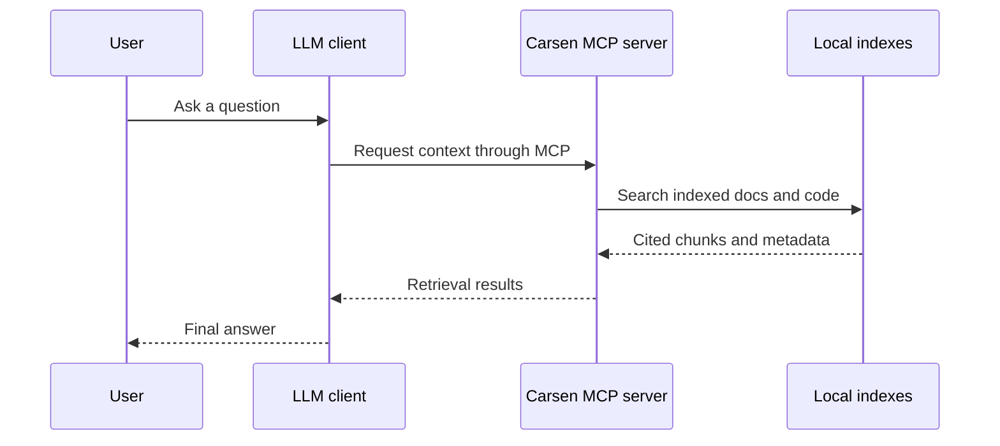

# Connect Carsen to an LLM

## The short version

Carsen is not an LLM. It is a local-first MCP knowledge server that indexes your material, retrieves cited context, and gives that context to an LLM client. Your LLM remains replaceable, and Carsen does not require a specific LLM provider.

## How Carsen, MCP and the LLM fit together

MCP lets an LLM client ask Carsen for relevant context instead of relying only on pasted text. Carsen searches its local indexes and returns cited chunks with metadata. The LLM then writes the final response.



## Prepare a knowledge instance

Create, validate and index an instance before connecting a client:

```bash
carsen create my-project --code ./src --documents ./docs
carsen validate my-project
carsen index my-project
carsen search my-project "Where is the main configuration?" --debug
```

## Local stdio MCP configuration

Many MCP-capable desktop apps, editors and agent tools can launch a local stdio server. Each client has its own config file location, but the server entry usually looks like this:

```json
{
  "mcpServers": {
    "carsen-my-project": {
      "command": "carsen",
      "args": ["serve", "my-project", "--transport", "stdio"]
    }
  }
}
```

## HTTP MCP configuration

For clients that connect to a local HTTP MCP server, start Carsen with:

```bash
carsen serve my-project --transport http
```

Use HTTP locally by default. Do not expose the server to a network unless you understand the access and data disclosure risks for your indexed sources.

## Ask useful first questions

Try questions that ask the LLM client to use Carsen and cite files:

- "Use Carsen to explain how indexing works and cite the relevant files."
- "Find the configuration schema and summarize the important options."
- "Which source files implement MCP serving?"

## Use Carsen to learn Carsen

Create a self-reference instance with Carsen docs and source code:

```bash
carsen init-self --index
```

The default instance is `carsen-self`. It is designed for self-help questions about Carsen documentation and source behavior.

## Advanced: retrieving context for Python workflows

Python tools can call the Carsen CLI before invoking an LLM provider. A simple workflow is to run `carsen search NAME QUERY --debug`, collect the cited context, and pass those citations to your own generation step. Carsen stays responsible for retrieval, not final answer generation.

## Troubleshooting

- If the client cannot start Carsen, confirm `carsen --help` works in the same environment as the client.
- If answers lack citations, first run `carsen search` in a terminal to verify retrieval results; an instance with no chunks needs `carsen index NAME` before it can retrieve context.
- If the answer sounds unguided, remind the client that Carsen retrieves context and the LLM writes the final answer.
- If HTTP fails, confirm the local URL, port and `/mcp` path expected by your client.
- If semantic search is unavailable, check Qdrant and embedding provider configuration, or use sparse/local retrieval first.
