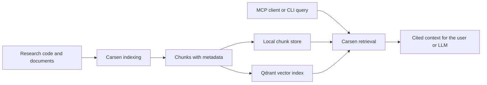

# Quickstart for academic users

Carsen turns a collection of code, papers, notes or documentation into a searchable knowledge service for MCP-capable tools. You can think of it as a local research librarian: first it reads and indexes your material, then it helps your AI tools retrieve the relevant passages with citations.



## What you will build

In this quickstart you will create one Carsen knowledge instance, index a small project, run a search and optionally serve the instance over MCP.

## Prerequisites

- Python 3.12 or newer.
- `uv` for Python environment management.
- Docker if you want dense vector search with Qdrant.

## 1. Install Carsen for development

```bash
uv pip install -e '.[dev]'
carsen --help
```

## 2. Start Qdrant

Qdrant is the local vector database Carsen uses for dense semantic search. If you are just experimenting with local chunks, you can skip Qdrant at first. If you want semantic search, start it with Docker:

```bash
docker run --rm -p 6333:6333 -p 6334:6334 qdrant/qdrant
```

## 3. Create a knowledge instance

```bash
carsen create my-lab-notes --code ./src --documents ./docs
carsen validate my-lab-notes
```

## 4. Index your sources

```bash
carsen index my-lab-notes
```

To also create embeddings in Qdrant:

```bash
carsen index my-lab-notes --embed
```

## 5. Search locally

```bash
carsen search my-lab-notes "How is retrieval configured?" --debug
```

The result should include source paths and citation metadata so you can trace answers back to the original material.

## 6. Serve over MCP

```bash
carsen serve my-lab-notes --transport stdio
```

For HTTP clients:

```bash
carsen serve my-lab-notes --transport http
```

The MCP endpoint is `/mcp`.

## Next steps

- Read [Core concepts](concepts.md) if Qdrant, embeddings or MCP are new to you.
- Read [Configuration](configuration.md) to adapt Carsen to your project.
- Read [Security](security.md) before exposing any service outside your machine.
