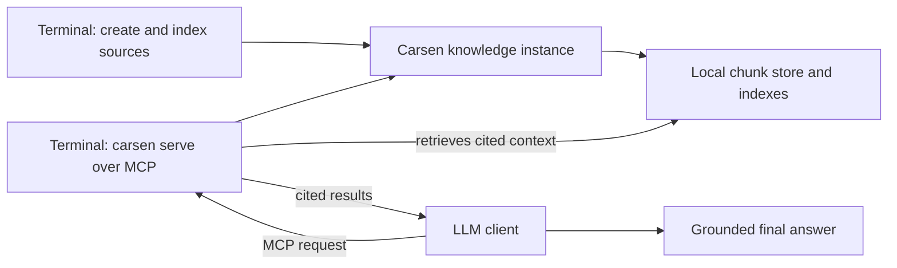

# Quickstart

This guide takes you from a clean installation to a Carsen knowledge instance that an LLM-capable MCP client can use.

## What you are setting up

Carsen is not an LLM and does not write final answers. Carsen indexes your material, retrieves cited context, and serves that context to clients through MCP. Your LLM client remains responsible for the final response. Carsen is local-first by default and provider-neutral: you choose the LLM client and provider.



## 1. Install Carsen

Use Python 3.12 or newer. In a development checkout, install Carsen with:

```bash
uv pip install -e '.[dev]'
carsen --help
```

## 2. Create your first knowledge instance

Create an isolated instance for your project sources:

```bash
carsen create my-project --code ./src --documents ./docs
carsen validate my-project
```

Each named instance has its own configuration, local state and indexes.

## 3. Index your sources

Parse your files into canonical chunks:

```bash
carsen index my-project
```

If you have Qdrant and an embedding provider configured, add dense embeddings:

```bash
carsen index my-project --embed
```

## 4. Test retrieval before using an LLM

Check that Carsen can retrieve useful context before connecting an LLM client:

```bash
carsen search my-project "How is retrieval configured?" --debug
```

Look for source paths, snippets and citation metadata in the results.

## 5. Serve the instance over MCP

Start the MCP server for local stdio clients:

```bash
carsen serve my-project --transport stdio
```

For local HTTP clients, use:

```bash
carsen serve my-project --transport http
```

HTTP serves MCP at `/mcp`. Keep it bound to localhost unless you have reviewed the security implications.

## 6. Add Carsen to an LLM client

Add a Carsen MCP server entry to your MCP-capable desktop app, editor or agent tool. A typical stdio entry looks like:

```json
{
  "mcpServers": {
    "carsen-my-project": {
      "command": "carsen",
      "args": ["serve", "my-project", "--transport", "stdio"]
    }
  }
}
```

See [Connect Carsen to an LLM](llm-integration.md) for provider-neutral setup notes.

## 7. Ask your first grounded question

In your LLM client, ask a question that should be answered from your indexed project, such as:

> Use Carsen to find where retrieval is configured and cite the relevant files.

The client asks Carsen for context through MCP, then the LLM writes the final answer using the retrieved citations.

## Optional: create a Carsen self-reference instance

To use Carsen for help with Carsen itself, create the default `carsen-self` instance. It indexes the Carsen documentation plus the source package, so it is useful for self-help across docs and source code:

```bash
carsen init-self
carsen index carsen-self
```

Or create and index it in one step:

```bash
carsen init-self --index
```

You can customize the instance name, docs path and source path with `--name`, `--docs-path` and `--source`.
