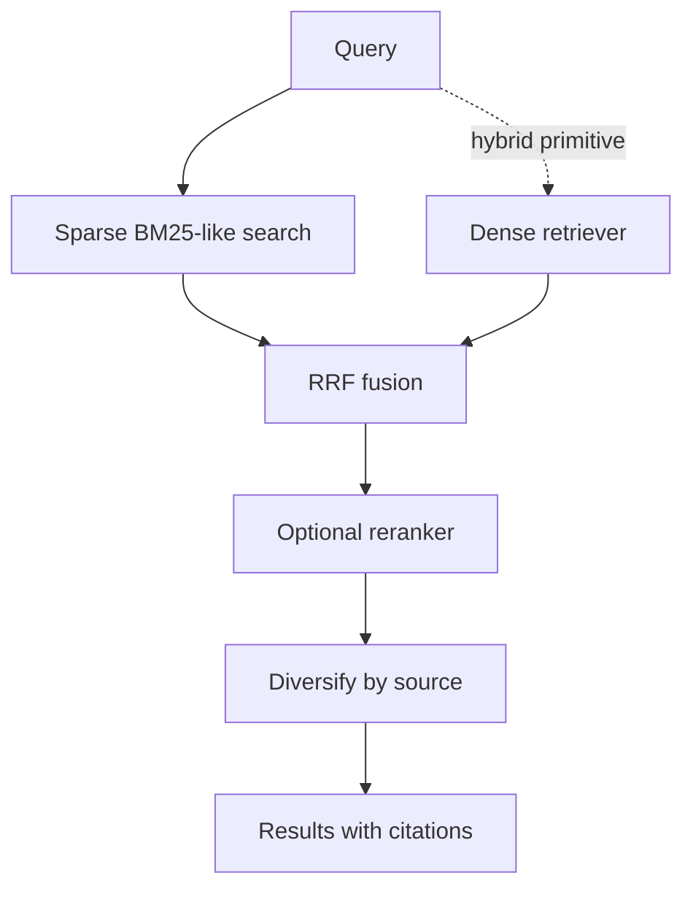

# Retrieval

The MCP runtime runs sparse lexical retrieval over the local chunk store, and hybrid dense/sparse retrieval when `retrieval.dense_candidates` is greater than zero and a Qdrant collection is reachable. When the dense path is unavailable, search falls back to sparse and reports the reason in diagnostics.



## Sparse search

Sparse retrieval tokenises source-like text, preserving dotted identifiers, and runs the query against the per-instance SQLite FTS5 index (BM25, with the text, symbol and path columns weighted). Exact and partial symbol matches, path matches and XML-path matches add the same score bonuses on the returned candidates. The in-memory `SparseRetriever` remains as the reference implementation and for callers that already hold a chunk list.

## Hybrid pipeline primitives

`HybridRetriever` calls dense and sparse retrievers, fuses candidates with reciprocal rank fusion, optionally reranks, diversifies by source and returns diagnostics including citations. Configuration controls dense candidate count, sparse candidate count, final result count and maximum results per source.

Set `retrieval.rerank: true` to rerank fused candidates with `models.reranker` before diversification. The runtime builds the reranker once per instance and loads its model lazily on the first search; a reranker failure falls back to the fused order and is surfaced as `reranker_error` in `search_debug`.

## Filters

Filters are metadata predicates applied consistently across the sparse and dense paths:

- a scalar value matches by equality (`{"source_type": "code"}`);
- a list, tuple or set matches any of its members (`{"language": ["python", "rust"]}`);
- `path_prefix` / `source_path_prefix` match sources whose path starts with the given string.

Dense filtering uses top-level Qdrant payload fields with keyword payload indexes (`knowledge_id`, `source_path`, `kind`, `source_type`, `document_type`, `language`, `repository_name`); prefix predicates are applied client-side after the vector query. Changing which metadata is promoted requires `carsen reembed`.

MCP `search_code` applies `source_type: code` and falls back to `document_type: code` if needed. `search_documents` applies `source_type: documents`.

## CLI search and diagnostics

Local chunk stores can be searched without starting an MCP server:

```bash
carsen search NAME "calibration constant"
carsen search --config path/to/config.yaml "calibration constant" --corpus code --limit 5
carsen search NAME "calibration constant" --debug
```

Normal output shows a citation and short content preview. Debug output is deliberately redacted: it reports retrieval mode, fallback reason where present, candidate counts and chunk IDs/citations, not full confidential content.

## Evaluation

Use `carsen evaluate NAME DATASET` or `carsen evaluate --config path/to/config.yaml DATASET` to run YAML retrieval datasets through the local `InstanceRuntime`. Output includes `query_count`, `recall@5`, `recall@10` and `mrr`.

Operational release smoke should include one `carsen search --debug` call after `index --embed` against a real Qdrant service, confirming that the reported mode is `hybrid` and that citations are returned from metadata.
