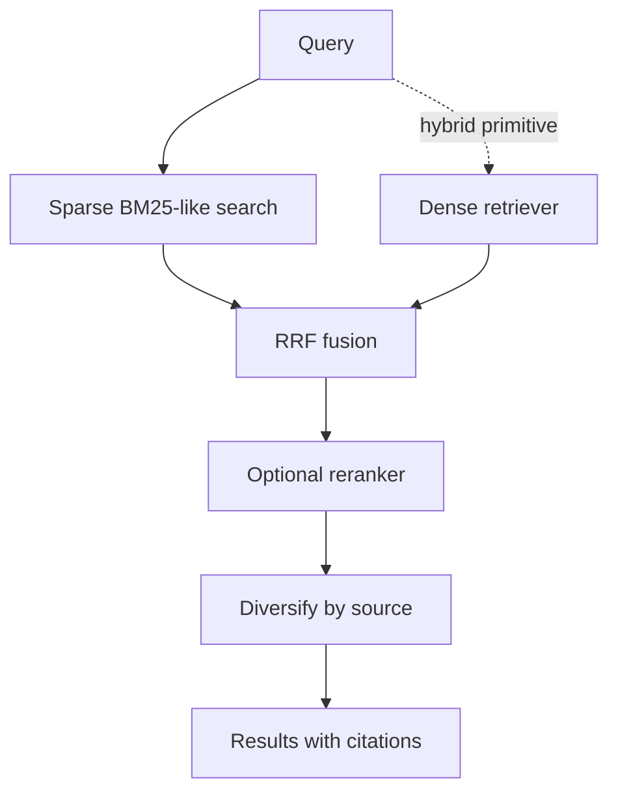

# Retrieval

The implemented MCP runtime uses sparse lexical retrieval over the local chunk store. The retrieval package also contains hybrid primitives for combining dense and sparse candidates.



## Sparse search

Sparse retrieval tokenises source-like text, preserving dotted identifiers. It scores chunk text plus symbol, source path and kind, with additional boosts for exact or partial symbol matches.

## Hybrid pipeline primitives

`HybridRetriever` calls dense and sparse retrievers, fuses candidates with reciprocal rank fusion, optionally reranks, diversifies by source and returns diagnostics including citations. Configuration controls dense candidate count, sparse candidate count, final result count and maximum results per source.

## Filters

Filters are simple metadata equality checks. MCP `search_code` applies `source_type: code` and falls back to `document_type: code` if needed. `search_documents` applies `source_type: documents`.

## CLI search and diagnostics

Local chunk stores can be searched without starting an MCP server:

```bash
carsen search NAME "calibration constant"
carsen search --config path/to/config.yaml "calibration constant" --corpus code --limit 5
carsen search NAME "calibration constant" --debug
```

Normal output shows a citation and short content preview. Debug output is deliberately redacted: it reports retrieval mode, fallback reason where present, candidate counts and chunk IDs/citations, not full confidential content.

## Evaluation

Use `carsen evaluate NAME DATASET` or `carsen evaluate --config path/to/config.yaml DATASET` to run YAML retrieval datasets through the local `InstanceRuntime`. Output includes `query_count`, `recall@5`, `recall@10` and `mrr`.

Operational release smoke should include one `carsen search --debug` call after `index --embed` against a real Qdrant service, confirming that the reported mode is `hybrid` and that citations are returned from metadata.
