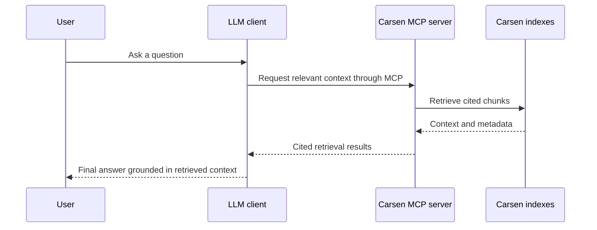

# Beginner LLM Docs and Self-Docs Init Implementation Plan

> **For agentic workers:** REQUIRED SUB-SKILL: Use superpowers:subagent-driven-development (recommended) or superpowers:executing-plans to implement this plan task-by-task. Steps use checkbox (`- [ ]`) syntax for tracking.

**Goal:** Build a beginner-friendly Carsen onboarding path that explains LLM/MCP use, refreshes the documentation presentation, and adds `carsen init-docs` for indexing Carsen's own documentation as an isolated MCP knowledge instance.

**Architecture:** Keep runtime behavior aligned with Carsen's named-instance model. Add a small self-docs configuration helper in registry/config-facing code, expose it through Typer, and keep LLM documentation provider-neutral. Use MkDocs Material styling with a restrained custom stylesheet and the existing three logo assets.

**Tech Stack:** Python 3.12, Typer, Pydantic, PyYAML, MkDocs Material, pytest, Ruff, mypy.

**Spec:** `docs/superpowers/specs/2026-08-24-beginner-llm-docs-and-self-docs-design.md`

## Global Constraints

- Preserve named-instance isolation.
- Do not add provider-specific LLM SDK dependencies.
- Do not turn Carsen into an answer-generation system.
- Do not make Qdrant mandatory for documentation-only setup or config inspection paths.
- Keep local-first defaults.
- Keep generated configs compatible with existing registry and config models.
- Keep docs and UI copy in English.
- Do not reintroduce Ariadne naming.
- Do not commit unless explicitly asked.

---

## File Structure

- `src/carsen_mcp/registry.py`: add focused helper(s) for creating the self-docs configuration while reusing existing config serialization and registry path logic.
- `src/carsen_mcp/cli.py`: expose `carsen init-docs`, map CLI options to registry helper, optionally call existing indexing flow.
- `tests/test_registry.py`: unit tests for self-docs config generation and overwrite/force behavior.
- `tests/test_mcp_runtime.py` or new `tests/test_cli_init_docs.py`: Typer CLI tests for command behavior, help, error messages and optional indexing call.
- `tests/test_documentation_presence.py`: require the new LLM guide, stylesheet, logo references and `init-docs` docs references.
- `tests/test_v1_evaluate_cli.py`: extend command-reference presence check to include `carsen init-docs`.
- `mkdocs.yml`: update logo/favicon, Material features, `extra_css`, and navigation.
- `docs/index.md`: refresh homepage.
- `docs/quickstart.md`: expand beginner quickstart.
- `docs/llm-integration.md`: create complete LLM/MCP guide.
- `docs/mcp.md` and `docs/concepts/mcp.md`: link the new guide and clarify the LLM/MCP flow.
- `docs/cli-reference.md`: document `carsen init-docs`.
- `docs/stylesheets/extra.css`: create restrained docs styling.

---

### Task 1: Registry helper for self-docs configs

**Files:**
- Modify: `src/carsen_mcp/registry.py`
- Test: `tests/test_registry.py`

**Interfaces:**
- Consumes: `default_config(name: str) -> CarsenConfig`, `SourcePathConfig`, `config_path_for`, `dump_config`.
- Produces:
  - `create_self_docs_config(name: str = "carsen-docs", source: Path | None = None, docs_path: Path | None = None, overwrite: bool = False, base_dir: Path | None = None) -> Path`
  - The function writes a registry YAML and returns its path.

- [ ] **Step 1: Add failing tests for default self-docs config generation**

Append to `tests/test_registry.py`:

```python
def test_create_self_docs_config_from_source_tree(tmp_path: Path) -> None:
    source = tmp_path / "carsen"
    docs = source / "docs"
    package = source / "src" / "carsen_mcp"
    docs.mkdir(parents=True)
    package.mkdir(parents=True)

    from carsen_mcp.registry import create_self_docs_config

    config_path = create_self_docs_config(source=source, base_dir=tmp_path)
    assert config_path == tmp_path / "carsen-docs.yaml"

    cfg = list_configs(base_dir=tmp_path)[0]
    assert cfg.knowledge.id == "carsen-docs"
    assert cfg.knowledge.name == "Carsen documentation"
    assert "Carsen documentation" in cfg.knowledge.description
    assert cfg.sources.documents[0].path == docs
    assert cfg.sources.code[0].path == package
    assert cfg.storage.collection == "kb_carsen_docs"
    assert cfg.server.transport == "stdio"
```

- [ ] **Step 2: Add failing tests for explicit docs path, missing docs and overwrite behavior**

Append to `tests/test_registry.py`:

```python
def test_create_self_docs_config_with_explicit_docs_path(tmp_path: Path) -> None:
    docs = tmp_path / "published-docs"
    docs.mkdir()

    from carsen_mcp.registry import create_self_docs_config

    create_self_docs_config(name="docs-help", docs_path=docs, base_dir=tmp_path)

    cfg = list_configs(base_dir=tmp_path)[0]
    assert cfg.knowledge.id == "docs-help"
    assert cfg.sources.documents[0].path == docs
    assert cfg.sources.code == []


def test_create_self_docs_config_fails_when_docs_are_missing(tmp_path: Path) -> None:
    source = tmp_path / "carsen"
    source.mkdir()

    from carsen_mcp.registry import create_self_docs_config
    with pytest.raises(FileNotFoundError, match="Could not find Carsen documentation"):
        create_self_docs_config(source=source, base_dir=tmp_path)


def test_create_self_docs_config_requires_overwrite(tmp_path: Path) -> None:
    docs = tmp_path / "docs"
    docs.mkdir()

    from carsen_mcp.registry import create_self_docs_config
    create_self_docs_config(docs_path=docs, base_dir=tmp_path)

    with pytest.raises(FileExistsError, match="already exists"):
        create_self_docs_config(docs_path=docs, base_dir=tmp_path)

    create_self_docs_config(docs_path=docs, overwrite=True, base_dir=tmp_path)
```

- [ ] **Step 3: Run tests to verify they fail**

Run: `.venv/bin/python -m pytest tests/test_registry.py -v`

Expected: FAIL because `create_self_docs_config` does not exist.

- [ ] **Step 4: Implement the registry helper**

In `src/carsen_mcp/registry.py`, add after `create_config`:

```python
def create_self_docs_config(
    name: str = "carsen-docs",
    source: Path | None = None,
    docs_path: Path | None = None,
    overwrite: bool = False,
    base_dir: Path | None = None,
) -> Path:
    """Create a registry configuration for Carsen's own documentation."""

    source_root = (source or Path.cwd()).expanduser().resolve()
    docs_root = (docs_path.expanduser().resolve() if docs_path is not None else source_root / "docs")
    if not docs_root.exists() or not docs_root.is_dir():
        raise FileNotFoundError(f"Could not find Carsen documentation at {docs_root}. Run this command from a Carsen source checkout or pass --docs-path PATH.")

    cfg = default_config(name)
    cfg.knowledge.name = "Carsen documentation"
    cfg.knowledge.description = "Carsen's own documentation and source package, indexed as an isolated knowledge instance for MCP-assisted setup help."
    cfg.sources.documents = [SourcePathConfig(path=docs_root)]

    package_root = source_root / "src" / "carsen_mcp"
    cfg.sources.code = [SourcePathConfig(path=package_root)] if package_root.exists() and package_root.is_dir() else []

    target = config_path_for(cfg.name, base_dir)
    target.parent.mkdir(parents=True, exist_ok=True)
    if target.exists() and not overwrite:
        raise FileExistsError(f"configuration '{name}' already exists; use --force to replace it")
    target.write_text(dump_config(cfg), encoding="utf-8")
    return target
```

- [ ] **Step 5: Run registry tests**

Run: `.venv/bin/python -m pytest tests/test_registry.py -v`

Expected: PASS.

---

### Task 2: CLI command `carsen init-docs`

**Files:**
- Modify: `src/carsen_mcp/cli.py`
- Create: `tests/test_cli_init_docs.py`

**Interfaces:**
- Consumes: `create_self_docs_config(...) -> Path` from Task 1.
- Produces: Typer command `init-docs` with options `--docs-path`, `--source`, `--name`, `--index`, `--force`.

- [ ] **Step 1: Write failing CLI tests**

Create `tests/test_cli_init_docs.py`:

```python
from __future__ import annotations

from pathlib import Path

from typer.testing import CliRunner

from carsen_mcp.cli import app


def test_init_docs_cli_creates_config(tmp_path: Path, monkeypatch) -> None:
    registry = tmp_path / "registry"
    source = tmp_path / "carsen"
    (source / "docs").mkdir(parents=True)
    (source / "src" / "carsen_mcp").mkdir(parents=True)
    monkeypatch.setenv("CARSEN_CONFIG_DIR", str(registry))

    result = CliRunner().invoke(app, ["init-docs", "--source", str(source)])

    assert result.exit_code == 0, result.stdout
    assert "Created Carsen documentation configuration" in result.stdout
    assert "carsen index carsen-docs" in result.stdout
    assert (registry / "carsen-docs.yaml").exists()


def test_init_docs_cli_reports_missing_docs(tmp_path: Path, monkeypatch) -> None:
    registry = tmp_path / "registry"
    source = tmp_path / "carsen"
    source.mkdir()
    monkeypatch.setenv("CARSEN_CONFIG_DIR", str(registry))

    result = CliRunner().invoke(app, ["init-docs", "--source", str(source)])

    assert result.exit_code != 0
    assert "Could not find Carsen documentation" in result.stdout


def test_init_docs_cli_index_flag_calls_indexer(tmp_path: Path, monkeypatch) -> None:
    registry = tmp_path / "registry"
    docs = tmp_path / "docs"
    docs.mkdir()
    monkeypatch.setenv("CARSEN_CONFIG_DIR", str(registry))
    called = {}

    def fake_index_config(config, force: bool = False, embed: bool = False):
        called["knowledge_id"] = config.knowledge.id
        called["force"] = force
        called["embed"] = embed

        class Report:
            new = 1
            unchanged = 0
            changed = 0
            deleted = 0
            chunks = 2

        return Report()

    monkeypatch.setattr("carsen_mcp.ingestion.indexer.index_config", fake_index_config)

    result = CliRunner().invoke(app, ["init-docs", "--docs-path", str(docs), "--index"])

    assert result.exit_code == 0, result.stdout
    assert called == {"knowledge_id": "carsen-docs", "force": False, "embed": False}
    assert "Indexed 'carsen-docs'" in result.stdout
```

- [ ] **Step 2: Run CLI tests to verify they fail**

Run: `.venv/bin/python -m pytest tests/test_cli_init_docs.py -v`

Expected: FAIL because the `init-docs` command is missing.

- [ ] **Step 3: Implement the CLI command**

In `src/carsen_mcp/cli.py`, update imports:

```python
from .registry import create_config, create_self_docs_config, discover_configs, instance_metadata, list_configs
```

Add after `create(...)`:

```python
@app.command("init-docs")
def init_docs(
    name: Annotated[str, typer.Option(help="Knowledge instance identifier for the Carsen docs instance.")] = "carsen-docs",
    source: Annotated[Path | None, typer.Option(help="Carsen source checkout containing a docs/ directory.")] = None,
    docs_path: Annotated[Path | None, typer.Option(help="Explicit Carsen documentation directory to index.")] = None,
    index_after_create: Annotated[bool, typer.Option("--index", help="Run indexing after writing the configuration.")] = False,
    force: Annotated[bool, typer.Option("--force", help="Replace an existing registry configuration.")] = False,
) -> None:
    """Create a local Carsen documentation knowledge instance."""

    try:
        path = create_self_docs_config(name=name, source=source, docs_path=docs_path, overwrite=force)
    except (FileExistsError, FileNotFoundError) as exc:
        raise typer.BadParameter(str(exc)) from exc

    typer.echo(f"Created Carsen documentation configuration: {path}")
    if index_after_create:
        from .ingestion.indexer import index_config

        cfg = load_config(path)
        report = index_config(cfg)
        typer.echo(f"Indexed '{cfg.knowledge.id}': new={report.new} unchanged={report.unchanged} changed={report.changed} deleted={report.deleted} chunks={report.chunks}")
    else:
        typer.echo(f"Next: carsen index {name}")
    typer.echo(f"Search: carsen search {name} \"How do I connect Carsen to an LLM?\"")
    typer.echo(f"Serve: carsen serve {name} --transport stdio")
```

- [ ] **Step 4: Run CLI tests**

Run: `.venv/bin/python -m pytest tests/test_cli_init_docs.py -v`

Expected: PASS.

- [ ] **Step 5: Run focused registry + CLI tests**

Run: `.venv/bin/python -m pytest tests/test_registry.py tests/test_cli_init_docs.py -v`

Expected: PASS.

---

### Task 3: Documentation presence and CLI reference tests

**Files:**
- Modify: `tests/test_documentation_presence.py`
- Modify: `tests/test_v1_evaluate_cli.py`

**Interfaces:**
- Consumes: docs files created in later tasks.
- Produces: executable documentation requirements that guide Task 4 and Task 5.

- [ ] **Step 1: Add failing docs presence checks**

In `tests/test_documentation_presence.py`, add `docs/llm-integration.md` to `REQUIRED_DOCS` and append this test:

```python
def test_llm_integration_and_init_docs_are_documented() -> None:
    llm = (ROOT / "docs" / "llm-integration.md").read_text(encoding="utf-8")
    quickstart = (ROOT / "docs" / "quickstart.md").read_text(encoding="utf-8")
    cli = (ROOT / "docs" / "cli-reference.md").read_text(encoding="utf-8")
    mkdocs = (ROOT / "mkdocs.yml").read_text(encoding="utf-8")

    for text in [llm, quickstart, cli]:
        assert "carsen init-docs" in text
        assert "LLM" in text
        assert "MCP" in text
    assert "llm-integration.md" in mkdocs
```

Append another visual configuration test:

```python
def test_mkdocs_uses_brand_assets_and_custom_stylesheet() -> None:
    text = (ROOT / "mkdocs.yml").read_text(encoding="utf-8")
    assert "logo: assets/logo_character.png" in text
    assert "favicon: assets/logo_character.png" in text
    assert "stylesheets/extra.css" in text
    assert (ROOT / "docs" / "assets" / "logo.png").exists()
    assert (ROOT / "docs" / "assets" / "logo_character.png").exists()
    assert (ROOT / "docs" / "assets" / "logo_text.png").exists()
    assert (ROOT / "docs" / "stylesheets" / "extra.css").exists()
```

- [ ] **Step 2: Extend CLI reference command test**

In `tests/test_v1_evaluate_cli.py`, update the command list:

```python
for command in ["carsen search", "carsen evaluate", "carsen serve-all", "carsen index", "carsen delete-index", "carsen init-docs"]:
    assert command in text
```

- [ ] **Step 3: Run docs tests to verify they fail**

Run: `.venv/bin/python -m pytest tests/test_documentation_presence.py tests/test_v1_evaluate_cli.py::test_cli_reference_documents_key_commands -v`

Expected: FAIL until docs and MkDocs config are updated.

---

### Task 4: MkDocs visual refresh and homepage

**Files:**
- Modify: `mkdocs.yml`
- Modify: `docs/index.md`
- Create: `docs/stylesheets/extra.css`

**Interfaces:**
- Consumes: existing assets `docs/assets/logo.png`, `docs/assets/logo_character.png`, `docs/assets/logo_text.png`.
- Produces: updated docs site navigation and custom CSS classes used by homepage Markdown.

- [ ] **Step 1: Update MkDocs config**

In `mkdocs.yml`:

```yaml
theme:
  name: material
  logo: assets/logo_character.png
  favicon: assets/logo_character.png
  features:
    - navigation.sections
    - navigation.expand
    - navigation.top
    - navigation.instant
    - navigation.instant.prefetch
    - navigation.tracking
    - search.suggest
    - search.highlight
    - content.code.copy
    - content.tabs.link

extra_css:
  - stylesheets/extra.css
```

Add `Connect to an LLM: llm-integration.md` under `Getting started` after Quickstart.

- [ ] **Step 2: Create custom stylesheet**

Create `docs/stylesheets/extra.css`:

```css
.carsen-hero {
  display: grid;
  grid-template-columns: minmax(0, 1.4fr) minmax(220px, 0.6fr);
  gap: 2rem;
  align-items: center;
  padding: 2rem 0 1rem;
}

.carsen-hero__logo {
  max-width: min(360px, 100%);
  display: block;
  margin-inline: auto;
}

.carsen-wordmark {
  max-width: 220px;
  margin-bottom: 0.75rem;
}

.carsen-cta-row {
  display: flex;
  flex-wrap: wrap;
  gap: 0.75rem;
  margin: 1.25rem 0;
}

.carsen-card-grid {
  display: grid;
  grid-template-columns: repeat(auto-fit, minmax(220px, 1fr));
  gap: 1rem;
  margin: 1.5rem 0;
}

.carsen-card {
  border: 1px solid var(--md-default-fg-color--lightest);
  border-radius: 0.8rem;
  padding: 1rem;
  background: var(--md-default-bg-color);
  box-shadow: 0 0.3rem 1rem rgba(0, 0, 0, 0.04);
}

.carsen-card h3 {
  margin-top: 0;
}

.carsen-flow {
  border-left: 0.2rem solid var(--md-primary-fg-color);
  padding-left: 1rem;
}

@media (max-width: 760px) {
  .carsen-hero {
    grid-template-columns: 1fr;
  }
}
```

- [ ] **Step 3: Refresh homepage content**

Replace `docs/index.md` with English content using these classes:

```markdown
# Carsen

<section class="carsen-hero" markdown>
<div markdown>


Carsen is a local-first MCP knowledge engine for code and document collections. It retrieves cited context from your own material so an LLM-capable client can answer with better grounding.

<div class="carsen-cta-row" markdown>
[Start the quickstart](quickstart.md){ .md-button .md-button--primary }
[Connect to an LLM](llm-integration.md){ .md-button }
[Learn the concepts](concepts.md){ .md-button }
</div>
</div>

<div markdown>

</div>
</section>

## Why Carsen

<div class="carsen-card-grid" markdown>
<div class="carsen-card" markdown>
### Local-first
Keep configuration and indexed state on your machine by default.
</div>

<div class="carsen-card" markdown>
### Isolated instances
Create one named knowledge base per project, course, lab or corpus.
</div>

<div class="carsen-card" markdown>
### MCP serving
Expose retrieval to MCP-capable LLM clients without binding Carsen to one provider.
</div>

<div class="carsen-card" markdown>
### Cited retrieval
Return context with source metadata rather than fabricated references.
</div>
</div>

## How it works

<div class="carsen-flow" markdown>

1. Create a Carsen knowledge instance for your material.
2. Index code, notes, papers or documentation into canonical chunks.
3. Search from the terminal to confirm retrieval works.
4. Serve the instance over MCP.
5. Let your LLM client ask Carsen for cited context.

</div>

## Ask an LLM about Carsen itself

Carsen can create a local documentation instance for its own docs:

```bash
carsen init-docs --index
carsen search carsen-docs "How do I connect Carsen to an LLM?"
carsen serve carsen-docs --transport stdio
```
```

- [ ] **Step 4: Run docs tests introduced in Task 3**

Run: `.venv/bin/python -m pytest tests/test_documentation_presence.py -v`

Expected: still may FAIL until `docs/llm-integration.md` and `docs/cli-reference.md` are updated in Task 5.

---

### Task 5: Beginner quickstart, LLM guide and references

**Files:**
- Modify: `docs/quickstart.md`
- Create: `docs/llm-integration.md`
- Modify: `docs/mcp.md`
- Modify: `docs/concepts/mcp.md`
- Modify: `docs/cli-reference.md`

**Interfaces:**
- Consumes: `carsen init-docs` command from Task 2.
- Produces: English user-facing documentation for beginner LLM/MCP setup.

- [ ] **Step 1: Rewrite quickstart around the full beginner flow**

Ensure `docs/quickstart.md` contains these sections in English:

```markdown
# Quickstart

This guide takes you from a clean installation to a Carsen knowledge instance that an LLM-capable MCP client can use.

## What you are setting up

Carsen is not an LLM and does not write final answers. Carsen indexes your material, retrieves cited context, and serves that context to clients through MCP. Your LLM client remains responsible for the final response.

## 1. Install Carsen
...

## 2. Create your first knowledge instance
...

## 3. Index your sources
...

## 4. Test retrieval before using an LLM
...

## 5. Serve the instance over MCP
...

## 6. Add Carsen to an LLM client
...

## 7. Ask your first grounded question
...

## Optional: create a Carsen docs instance
...
```

Include a Mermaid diagram showing terminal indexing, MCP serving and LLM client use.

- [ ] **Step 2: Create the LLM integration guide**

Create `docs/llm-integration.md` with these concrete headings:

```markdown
# Connect Carsen to an LLM

## The short version
## How Carsen, MCP and the LLM fit together
## Prepare a knowledge instance
## Local stdio MCP configuration
## HTTP MCP configuration
## Ask useful first questions
## Use Carsen to learn Carsen
## Advanced: retrieving context for Python workflows
## Troubleshooting
```

Include this generic stdio snippet:

```json
{
  "mcpServers": {
    "carsen-my-project": {
      "command": "carsen",
      "args": ["serve", "my-project", "--transport", "stdio"]
    }
  }
}
```

Include this local HTTP example with safety wording:

```bash
carsen serve my-project --transport http
```

Do not name any LLM provider as required. It is acceptable to say that MCP-capable clients include desktop apps, editors and agent tools, and that each has its own config file location.

- [ ] **Step 3: Update MCP references**

In `docs/mcp.md`, add a top note:

```markdown
If you are trying to connect Carsen to an LLM client for the first time, start with [Connect Carsen to an LLM](llm-integration.md). This page is the lower-level MCP server reference.
```

In `docs/concepts/mcp.md`, add a Mermaid sequence diagram:

```markdown

```

- [ ] **Step 4: Document `init-docs` in CLI reference**

Add a section to `docs/cli-reference.md`:

```markdown
## `carsen init-docs`

Create a local registry configuration for Carsen's own documentation.

```bash
carsen init-docs
carsen init-docs --index
carsen init-docs --docs-path ./docs --name carsen-docs
```

By default the command creates an isolated `carsen-docs` instance and points it at the local Carsen documentation. Use `--index` to index immediately, or run `carsen index carsen-docs` afterwards.
```

- [ ] **Step 5: Run documentation tests**

Run: `.venv/bin/python -m pytest tests/test_documentation_presence.py tests/test_v1_evaluate_cli.py::test_cli_reference_documents_key_commands -v`

Expected: PASS.

---

### Task 6: Build, lint, type-check and final validation

**Files:**
- No direct edits expected unless verification finds issues.

**Interfaces:**
- Consumes all previous tasks.
- Produces verified implementation evidence.

- [ ] **Step 1: Run targeted CLI/config/docs tests**

Run:

```bash
.venv/bin/python -m pytest tests/test_registry.py tests/test_cli_init_docs.py tests/test_documentation_presence.py tests/test_v1_evaluate_cli.py::test_cli_reference_documents_key_commands -v
```

Expected: PASS.

- [ ] **Step 2: Run broader related tests**

Run:

```bash
.venv/bin/python -m pytest tests/test_config.py tests/test_mcp_runtime.py -v
```

Expected: PASS.

- [ ] **Step 3: Run MkDocs strict build**

Run:

```bash
uv run mkdocs build --strict
```

Expected: PASS with no broken links or warnings treated as errors.

- [ ] **Step 4: Run Ruff**

Run:

```bash
.venv/bin/python -m ruff check .
```

Expected: PASS.

- [ ] **Step 5: Run mypy**

Run:

```bash
.venv/bin/python -m mypy
```

Expected: PASS.

- [ ] **Step 6: Search for stale project names**

Run:

```bash
rg 'Ariadne|ariadne|ariadne_mcp'
```

Expected: no matches.

- [ ] **Step 7: Inspect git status**

Run:

```bash
git status --short
```

Expected: only intended docs, tests and source files are modified or added. The existing untracked logo/spec/plan files should be reported clearly as pre-existing if they remain untracked.

---

## Self-Review Notes

- Spec coverage: covered quickstart, LLM integration guide, MkDocs visual refresh, three logos, `init-docs`, tests, local-first and provider-neutral constraints.
- Scope check: combined milestone touches docs plus one small CLI helper; no full setup wizard or provider SDK work included.
- Type consistency: `create_self_docs_config(...) -> Path` is the only new helper consumed by CLI and tests.
- Verification path: targeted unit/CLI/docs tests first, then MkDocs strict build, Ruff, mypy and stale-name search.
