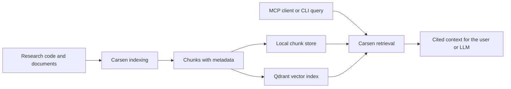
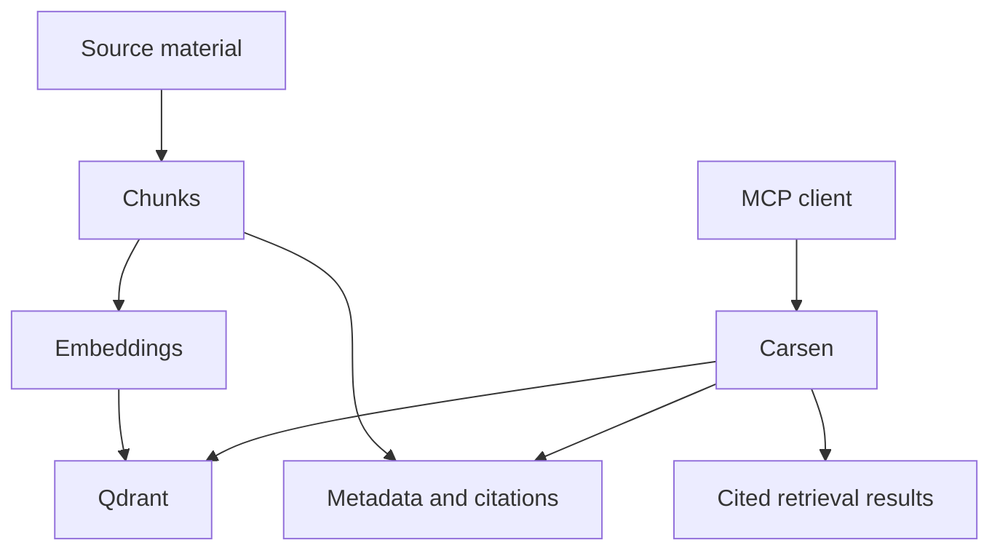
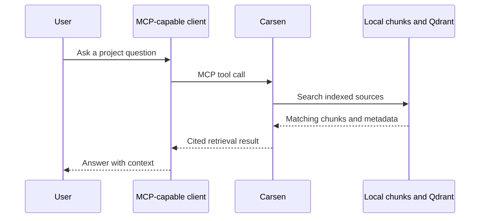
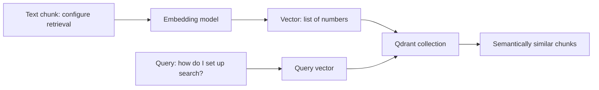
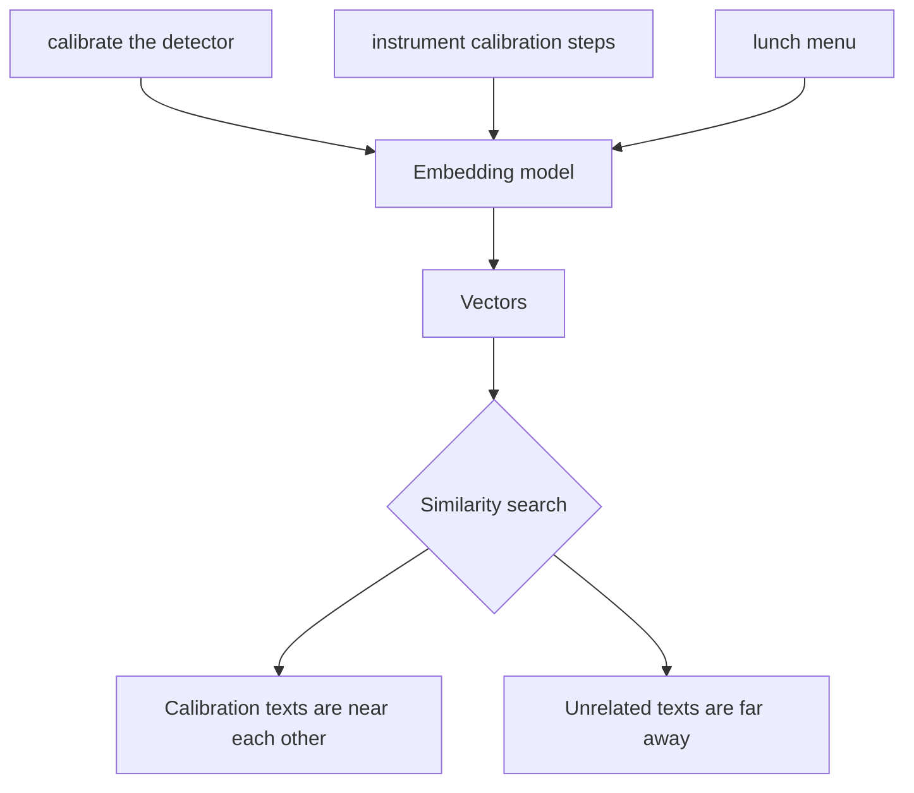
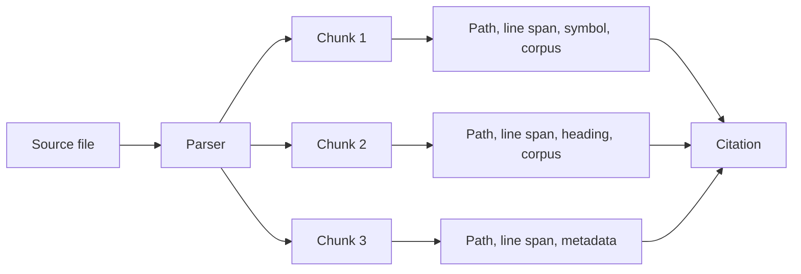

# Web Documentation Implementation Plan

> **For agentic workers:** REQUIRED SUB-SKILL: Use superpowers:subagent-driven-development (recommended) or superpowers:executing-plans to implement this plan task-by-task. Steps use checkbox (`- [ ]`) syntax for tracking.

**Goal:** Add a MkDocs Material documentation site for Carsen with English, diagram-rich, academic-user-friendly quickstart and concept pages.

**Architecture:** Carsen remains a Markdown-first documentation project. MkDocs Material builds the existing `docs/` tree into a static `site/` directory, with Mermaid diagrams embedded in Markdown. Runtime MCP serving is not changed in this phase.

**Tech Stack:** MkDocs, MkDocs Material, Markdown, Mermaid diagrams, Python optional dependencies, GitHub Actions.

**Spec:** `docs/superpowers/specs/2026-08-24-web-documentation-design.md`

## Global Constraints

- All new user-facing documentation must be in English.
- Use MkDocs Material, not Sphinx, for this phase.
- Include diagrams that help non-specialist academic users understand Carsen.
- Do not change `carsen serve`, MCP endpoints, retrieval behavior or runtime APIs in this phase.
- Keep `/mcp` untouched and do not introduce docs serving inside the MCP runtime.
- Build output remains `site/`, which is already ignored by `.gitignore`.

---

## File Structure

- Create `mkdocs.yml` — MkDocs Material configuration, navigation, theme, Markdown extensions and Mermaid support.
- Modify `pyproject.toml` — add a `docs` optional dependency group with `mkdocs` and `mkdocs-material`.
- Modify `.github/workflows/ci.yml` — add a docs build check using `mkdocs build --strict`.
- Modify `README.md` — add a short Documentation section linking to `docs/quickstart.md`, `docs/concepts.md` and build instructions.
- Modify `docs/index.md` — make it the website landing page and point to the new quickstart/concepts pages.
- Create `docs/quickstart.md` — beginner-friendly academic quickstart with commands and a Mermaid mental-model diagram.
- Create `docs/academic-users.md` — explanation for academic labs and research groups.
- Create `docs/concepts.md` — concept hub.
- Create `docs/concepts/mcp.md` — MCP explanation with diagram.
- Create `docs/concepts/qdrant.md` — Qdrant explanation with diagram.
- Create `docs/concepts/embeddings.md` — embeddings explanation with diagram.
- Create `docs/concepts/chunks-and-citations.md` — chunks/citations explanation with diagram.
- Modify `tests/test_documentation_presence.py` — assert key docs and MkDocs config exist and reference expected pages.
- Modify `tests/test_ci_scaffolding.py` — assert CI includes docs build.

---

### Task 1: MkDocs scaffolding and dependency configuration

**Files:**
- Create: `mkdocs.yml`
- Modify: `pyproject.toml`
- Modify: `.github/workflows/ci.yml`
- Test: `tests/test_ci_scaffolding.py`

**Interfaces:**
- Consumes: existing `docs/` Markdown tree and GitHub Actions workflow.
- Produces: `mkdocs build --strict` as the canonical docs build command.

- [ ] **Step 1: Add failing CI scaffold test**

Add this test to `tests/test_ci_scaffolding.py`:

```python
def test_ci_builds_documentation_site() -> None:
    workflow = Path(".github/workflows/ci.yml").read_text()

    assert ".[docs]" in workflow
    assert "mkdocs build --strict" in workflow
```

- [ ] **Step 2: Run the targeted test and confirm it fails**

Run:

```bash
.venv/bin/python -m pytest tests/test_ci_scaffolding.py::test_ci_builds_documentation_site -v
```

Expected: FAIL because CI does not yet install docs dependencies or run MkDocs.

- [ ] **Step 3: Add docs optional dependencies**

In `pyproject.toml`, add under `[project.optional-dependencies]`:

```toml
docs = [
  "mkdocs>=1.6",
  "mkdocs-material>=9.5",
]
```

- [ ] **Step 4: Create `mkdocs.yml`**

Create:

```yaml
site_name: Carsen
site_description: Local-first MCP knowledge engine for indexed code and document collections.
repo_url: https://github.com/LorenzoMugnai/Carsen
repo_name: LorenzoMugnai/Carsen

theme:
  name: material
  logo: assets/logo.png
  favicon: assets/logo.png
  features:
    - navigation.sections
    - navigation.expand
    - navigation.top
    - content.code.copy
    - content.tabs.link
  palette:
    - scheme: default
      primary: deep purple
      accent: teal

markdown_extensions:
  - admonition
  - attr_list
  - md_in_html
  - pymdownx.details
  - pymdownx.superfences:
      custom_fences:
        - name: mermaid
          class: mermaid
          format: !!python/name:pymdownx.superfences.fence_code_format
  - pymdownx.tabbed:
      alternate_style: true

nav:
  - Home: index.md
  - Getting started:
      - Quickstart: quickstart.md
      - Academic users: academic-users.md
  - Core concepts:
      - Overview: concepts.md
      - MCP: concepts/mcp.md
      - Qdrant: concepts/qdrant.md
      - Embeddings: concepts/embeddings.md
      - Chunks and citations: concepts/chunks-and-citations.md
  - Using Carsen:
      - Configuration: configuration.md
      - Knowledge instances: knowledge-instances.md
      - Indexing: indexing.md
      - Retrieval: retrieval.md
      - Citations: citations.md
      - MCP server: mcp.md
      - CLI reference: cli-reference.md
  - Operations:
      - Deployment: deployment.md
      - Security: security.md
      - Testing: testing.md
      - Troubleshooting: troubleshooting.md
  - Development:
      - Architecture: architecture.md
      - Development setup: development.md
      - Extending Carsen: extending.md
      - ADRs:
          - Separate knowledge instances: adr/0001-separate-knowledge-instances.md
          - Qdrant per-instance collections: adr/0002-qdrant-per-instance-collections.md
          - Canonical chunk store: adr/0003-canonical-chunk-store.md
          - Hybrid retrieval: adr/0004-hybrid-dense-sparse-retrieval.md
          - Metadata-backed citations: adr/0005-metadata-backed-citations.md
          - Generative LLM independence: adr/0006-generative-llm-independence.md
```

- [ ] **Step 5: Add CI docs build step**

In `.github/workflows/ci.yml`, add a step after installing the project with dev dependencies or add a separate docs install step:

```yaml
      - name: Install docs dependencies
        run: uv pip install -e '.[docs]'

      - name: Build documentation
        run: mkdocs build --strict
```

- [ ] **Step 6: Run targeted test**

Run:

```bash
.venv/bin/python -m pytest tests/test_ci_scaffolding.py::test_ci_builds_documentation_site -v
```

Expected: PASS.

---

### Task 2: Documentation inventory tests

**Files:**
- Modify: `tests/test_documentation_presence.py`
- Later tasks create: `docs/quickstart.md`, `docs/academic-users.md`, `docs/concepts.md`, `docs/concepts/*.md`

**Interfaces:**
- Consumes: expected docs paths and `mkdocs.yml` navigation.
- Produces: tests that prevent removal of didactic docs and diagrams.

- [ ] **Step 1: Add failing documentation presence tests**

Add to `tests/test_documentation_presence.py`:

```python
def test_mkdocs_site_configuration_exists() -> None:
    config = Path("mkdocs.yml")

    assert config.exists()
    text = config.read_text()
    assert "site_name: Carsen" in text
    assert "theme:" in text
    assert "material" in text
    assert "quickstart.md" in text
    assert "concepts/qdrant.md" in text


def test_didactic_documentation_pages_exist() -> None:
    required = [
        Path("docs/quickstart.md"),
        Path("docs/academic-users.md"),
        Path("docs/concepts.md"),
        Path("docs/concepts/mcp.md"),
        Path("docs/concepts/qdrant.md"),
        Path("docs/concepts/embeddings.md"),
        Path("docs/concepts/chunks-and-citations.md"),
    ]

    for path in required:
        assert path.exists(), f"Missing documentation page: {path}"


def test_didactic_documentation_includes_diagrams() -> None:
    diagram_pages = [
        Path("docs/quickstart.md"),
        Path("docs/concepts/mcp.md"),
        Path("docs/concepts/qdrant.md"),
        Path("docs/concepts/embeddings.md"),
        Path("docs/concepts/chunks-and-citations.md"),
    ]

    for path in diagram_pages:
        text = path.read_text()
        assert "```mermaid" in text, f"Missing Mermaid diagram in {path}"
```

- [ ] **Step 2: Run targeted tests and confirm they fail before pages exist**

Run:

```bash
.venv/bin/python -m pytest tests/test_documentation_presence.py -v
```

Expected: FAIL until the new pages are created.

---

### Task 3: Academic quickstart and landing pages

**Files:**
- Create: `docs/quickstart.md`
- Create: `docs/academic-users.md`
- Modify: `docs/index.md`
- Modify: `README.md`

**Interfaces:**
- Consumes: existing README and docs hub.
- Produces: beginner path into the docs site.

- [ ] **Step 1: Create `docs/quickstart.md`**

Use this structure and content:

````markdown
# Quickstart for academic users

Carsen turns a collection of code, papers, notes or documentation into a searchable knowledge service for MCP-capable tools. You can think of it as a local research librarian: first it reads and indexes your material, then it helps your AI tools retrieve the relevant passages with citations.



## What you will build

In this quickstart you will create one Carsen knowledge instance, index a small project, run a search and optionally serve the instance over MCP.

## Prerequisites

- Python 3.12 or newer.
- `uv` for Python environment management.
- Docker if you want dense vector search with Qdrant.

## 1. Install Carsen for development

```bash
uv pip install -e '.[dev]'
carsen --help
```

## 2. Start Qdrant

Qdrant is the local vector database Carsen uses for dense semantic search. If you are just experimenting with local chunks, you can skip Qdrant at first. If you want semantic search, start it with Docker:

```bash
docker run --rm -p 6333:6333 -p 6334:6334 qdrant/qdrant
```

## 3. Create a knowledge instance

```bash
carsen create my-lab-notes --code ./src --documents ./docs
carsen validate my-lab-notes
```

## 4. Index your sources

```bash
carsen index my-lab-notes
```

To also create embeddings in Qdrant:

```bash
carsen index my-lab-notes --embed
```

## 5. Search locally

```bash
carsen search my-lab-notes "How is retrieval configured?" --debug
```

The result should include source paths and citation metadata so you can trace answers back to the original material.

## 6. Serve over MCP

```bash
carsen serve my-lab-notes --transport stdio
```

For HTTP clients:

```bash
carsen serve my-lab-notes --transport http
```

The MCP endpoint is `/mcp`.

## Next steps

- Read [Core concepts](concepts.md) if Qdrant, embeddings or MCP are new to you.
- Read [Configuration](configuration.md) to adapt Carsen to your project.
- Read [Security](security.md) before exposing any service outside your machine.
````

- [ ] **Step 2: Create `docs/academic-users.md`**

Use this structure and content:

````markdown
# Carsen for academic groups

Carsen is designed for research environments where knowledge is spread across code repositories, lab notes, technical documentation, papers, proposals and shared folders. The goal is not to replace careful reading. The goal is to make relevant context easier to retrieve, cite and inspect.

## Why this matters in research

Research projects often accumulate knowledge in many places:

- analysis scripts;
- instrument documentation;
- simulation outputs and notes;
- internal reports;
- student handover documents;
- project-specific conventions that are not published anywhere.

Carsen indexes those materials into a local knowledge instance. An MCP-capable assistant can then ask Carsen for relevant context instead of guessing from memory.

## A useful analogy

Imagine a library catalogue for your research project. The catalogue does not write the book for you. It tells you which shelf, page and paragraph are relevant. Carsen plays a similar role for AI tools: it retrieves context and citations, while the assistant or human still interprets the result.

## Recommended lab workflow

1. Create one Carsen instance per project, paper, instrument or collaboration.
2. Keep private projects in separate instances.
3. Index code and documentation after meaningful changes.
4. Use citations to verify every important answer.
5. Avoid exposing HTTP services publicly unless you understand the security implications.

## What Carsen is not

- It is not a magic source of truth.
- It is not a replacement for version control or data management.
- It is not an LLM provider.
- It does not remove the need to verify scientific claims.

## Good first use cases

- Searching a large codebase for relevant functions.
- Helping new students understand project documentation.
- Retrieving instrument or pipeline notes during analysis.
- Keeping separate knowledge bases for separate collaborations.
````

- [ ] **Step 3: Update `docs/index.md`**

Rewrite the top of `docs/index.md` so it starts with:

```markdown
# Carsen documentation

Carsen is a local-first MCP knowledge engine for indexed code and document collections. These docs are written for researchers, developers and academic teams who need reliable retrieval with traceable citations.

If you are new to vector search or MCP, start here:

- [Quickstart for academic users](quickstart.md)
- [Core concepts](concepts.md)
- [Carsen for academic groups](academic-users.md)
```

Preserve the existing links below that introduction.

- [ ] **Step 4: Add README documentation links**

Add a short section after the project introduction:

```markdown
## Documentation

- [Quickstart for academic users](docs/quickstart.md)
- [Core concepts](docs/concepts.md)
- [Full documentation index](docs/index.md)

To build the website locally:

```bash
uv pip install -e '.[docs]'
mkdocs serve
```
```

- [ ] **Step 5: Run documentation presence tests**

Run:

```bash
.venv/bin/python -m pytest tests/test_documentation_presence.py -v
```

Expected: still FAIL until concept pages are added in Task 4.

---

### Task 4: Concept pages with diagrams

**Files:**
- Create: `docs/concepts.md`
- Create: `docs/concepts/mcp.md`
- Create: `docs/concepts/qdrant.md`
- Create: `docs/concepts/embeddings.md`
- Create: `docs/concepts/chunks-and-citations.md`

**Interfaces:**
- Consumes: MkDocs navigation from Task 1.
- Produces: English concept documentation with Mermaid diagrams.

- [ ] **Step 1: Create `docs/concepts.md`**

````markdown
# Core concepts

Carsen combines several ideas that may be unfamiliar if you mostly work with traditional scripts, notebooks and file systems. This section explains the vocabulary before going deeper into configuration or deployment.



Start with:

- [MCP](concepts/mcp.md)
- [Qdrant](concepts/qdrant.md)
- [Embeddings](concepts/embeddings.md)
- [Chunks and citations](concepts/chunks-and-citations.md)
````

- [ ] **Step 2: Create `docs/concepts/mcp.md`**

````markdown
# What is MCP?

MCP stands for Model Context Protocol. It is a standard way for AI tools to ask external systems for context or actions. In Carsen, MCP lets an assistant ask questions such as "find the function that configures retrieval" or "read the source around this citation".



## Why it helps

Without MCP, an assistant often only sees the text you paste into the chat. With MCP, the assistant can request relevant project context from Carsen when it needs it.

## Important boundary

Carsen retrieves context. It does not decide which LLM writes the final answer. That keeps the retrieval layer independent from any one model provider.
````

- [ ] **Step 3: Create `docs/concepts/qdrant.md`**

````markdown
# What is Qdrant?

Qdrant is a vector database. A vector database stores numerical representations of text, called embeddings, and can find items with similar meaning even when they do not use the exact same words.



## Why Carsen uses Qdrant

Traditional search is good at exact words. Academic and technical questions often use different wording from the source material. Qdrant helps Carsen retrieve passages that are conceptually related to the query.

## What Qdrant stores

Carsen stores vectors in Qdrant collection names that are specific to each knowledge instance. The original citation metadata remains tied to Carsen's canonical chunks, so results can be traced back to source files.

## Local development

For local experiments, run Qdrant with Docker:

```bash
docker run --rm -p 6333:6333 -p 6334:6334 qdrant/qdrant
```
````

- [ ] **Step 4: Create `docs/concepts/embeddings.md`**

````markdown
# What are embeddings?

An embedding is a list of numbers that represents the meaning of a piece of text. Similar texts should have vectors that are close to each other.



## Why this matters

Researchers rarely ask questions using exactly the same wording as the documentation. Embeddings let Carsen retrieve meaning-related passages, not only exact keyword matches.

## Limitations

Embeddings are useful but imperfect. They can miss important details or retrieve plausible but irrelevant text. Carsen therefore combines dense retrieval with sparse and exact retrieval paths, and returns citations so users can verify results.
````

- [ ] **Step 5: Create `docs/concepts/chunks-and-citations.md`**

````markdown
# Chunks and citations

Carsen does not index a whole project as one large text. It splits source material into smaller records called chunks. Each chunk carries metadata that helps Carsen cite where it came from.



## What is a chunk?

A chunk is a manageable piece of a source file: for example a Python function, a Markdown section or a paragraph from a document. Smaller chunks make retrieval more precise.

## What is a citation?

A citation is the trace back to the original material. In Carsen this can include the source path, corpus, line span, symbol name or document heading.

## Why citations matter in academic work

Academic users need to verify claims. A retrieval result without a source trail is not enough. Carsen's citation metadata helps you inspect the original code or document before trusting an answer.
````

- [ ] **Step 6: Run documentation tests**

Run:

```bash
.venv/bin/python -m pytest tests/test_documentation_presence.py -v
```

Expected: PASS.

---

### Task 5: Build and final verification

**Files:**
- Generated only: `site/` ignored by git
- Verify all files from Tasks 1-4

**Interfaces:**
- Consumes: MkDocs config and docs content.
- Produces: verified docs build and clean code checks.

- [ ] **Step 1: Install docs dependencies**

Run:

```bash
uv pip install -e '.[dev,docs]'
```

Expected: install succeeds.

- [ ] **Step 2: Build docs strictly**

Run:

```bash
mkdocs build --strict
```

Expected: PASS with no warnings.

- [ ] **Step 3: Run Python quality gates**

Run:

```bash
.venv/bin/python -m ruff check .
.venv/bin/python -m mypy
.venv/bin/python -m pytest
```

Expected: Ruff passes, mypy reports no issues, pytest reports all tests passing except the existing intentional skip.

- [ ] **Step 4: Confirm generated site is ignored**

Run:

```bash
git status --short
```

Expected: `site/` does not appear as an untracked file.

- [ ] **Step 5: Commit**

Run:

```bash
git add mkdocs.yml pyproject.toml .github/workflows/ci.yml README.md docs tests
git commit -m "Add MkDocs documentation site"
```

Expected: commit succeeds with only intentional docs, tests and config files staged.

---

## Self-Review

Spec coverage:

- MkDocs Material scaffolding: Task 1.
- English academic-user quickstart: Task 3.
- Concept explanations for Qdrant, MCP, embeddings, chunks and citations: Task 4.
- Diagrams: Task 2 asserts them; Tasks 3-4 include Mermaid diagrams.
- CI docs build: Task 1.
- No runtime MCP changes: Global constraints and file structure exclude runtime files.

Placeholder scan: no `TBD`, `TODO`, `implement later` or unspecified test steps remain.

Type consistency: no new runtime interfaces are introduced; tests use `pathlib.Path`, matching existing test style.
